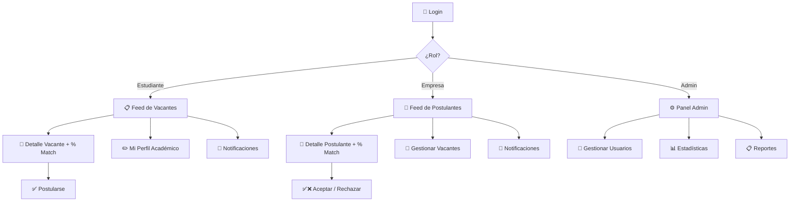

# Plan de Frontend — Plataforma de Matching Bidireccional

> Verificado contra: "CAPITULOS 1-2 PROYECTO" (Tesis UG)  
> Fecha: 15 de febrero de 2026

---

## Verificación contra la Tesis

Se revisó el documento de tesis para asegurar que el plan esté alineado. Resultado:

| Elemento de la tesis | ¿Incluido en el plan? | Notas |
|---|---|---|
| 5 módulos funcionales (Gestión Usuarios, Perfil Académico, Gestión Vacantes, Matching, Postulación) | ✅ Sí | Mapeados a páginas específicas |
| 3 roles (Admin, Estudiante, Empresa) | ✅ Sí | Dashboards independientes por rol |
| Arquitectura Cliente-Servidor (SPA) | ✅ Sí | Next.js (SPA) + Flask API |
| Matching bidireccional con % de afinidad | ✅ Sí | Visible en feeds de ambas partes |
| Filtrado basado en contenido (no colaborativo) | ✅ Sí | Sin historial de interacciones previas |
| Datos simulados (limitación) | ✅ Sí | No se usan datos reales de estudiantes |
| Sin integración con SIUG | ✅ Sí | Plataforma independiente |
| Comunicación por correo institucional | ✅ Sí | La plataforma solo facilita el matching |
| Notificaciones in-app | ⚠️ Añadido | No está explícito en la tesis, pero es necesario para simular el flujo de aceptación/rechazo. No contradice el alcance |
| Panel Admin con reportes | ⚠️ Añadido | La tesis menciona el rol Admin pero no detalla su vista. Los reportes/estadísticas son necesarios para la validación |

> **Conclusión:** No nos saltamos ningún módulo de la tesis. Las notificaciones y el panel admin son adiciones lógicas que no exceden el alcance.

---

## Los 5 Módulos de la Tesis → Páginas del Frontend

```mermaid
graph TD
    M1["Módulo 1: Gestión de Usuarios"] --> Login["/login"]
    M1 --> Register["/register"]
    M1 --> AdminUsers["/dashboard/admin/usuarios"]

    M2["Módulo 2: Perfil Académico"] --> PerfilE["/dashboard/estudiante/perfil"]

    M3["Módulo 3: Gestión de Vacantes"] --> CRUD["/dashboard/empresa/vacantes"]
    M3 --> AdminVac["/dashboard/admin/vacantes"]

    M4["Módulo 4: Matching"] --> FeedE["/dashboard/estudiante (feed vacantes)"]
    M4 --> FeedC["/dashboard/empresa (feed postulantes)"]
    M4 --> Detalle["Detalle con % de afinidad"]

    M5["Módulo 5: Postulación y Seguimiento"] --> Postular["Botón Postularme"]
    M5 --> MisPost["/dashboard/estudiante/postulaciones"]
    M5 --> AceptarRechazar["Aceptar/Rechazar postulante"]
```



---

## Flujo de Navegación por Rol



---

## Páginas por Módulo

### Módulo 1: Gestión de Usuarios 🔐

| Página | Ruta | Descripción |
|--------|------|-------------|
| Login | `/login` | Email + contraseña → JWT → redirige según rol |
| Registro | `/register` | Selector de rol ("Soy Estudiante" / "Soy Empresa"), campos cambian |

**Validaciones (para el jurado):**
- Email válido y único
- Contraseña: mínimo 8 caracteres, 1 mayúscula, 1 número
- Campos obligatorios resaltados con feedback visual
- Mensajes de error claros ("Este correo ya está registrado")
- Protección contra envío múltiple (botón se deshabilita)
- JWT expira → sesión cerrada automáticamente
- Rutas protegidas por rol (un estudiante NO puede acceder a `/dashboard/admin`)

---

### Módulo 2: Perfil Académico 🎓

| Página | Ruta | Descripción |
|--------|------|-------------|
| Mi Perfil | `/dashboard/estudiante/perfil` | Formulario editable con datos del estudiante |

**Campos del perfil (base para el matching):**
- Datos personales: nombre, cédula, carrera, semestre
- Habilidades técnicas (tags editables, ej: "Python", "React", "SQL")
- Competencias blandas (tags, ej: "Trabajo en equipo", "Liderazgo")
- Áreas de interés (ej: "Desarrollo Web", "Ciencia de Datos")
- Experiencia previa (opcional, texto libre)

> Estos campos son los que el motor NLP (SBERT) vectoriza para calcular la afinidad.

---

### Módulo 3: Gestión de Vacantes 🏢

| Página | Ruta | Descripción |
|--------|------|-------------|
| Mis Vacantes | `/dashboard/empresa/vacantes` | CRUD: crear, editar, eliminar, pausar vacantes |
| Crear Vacante | `/dashboard/empresa/vacantes/nueva` | Formulario con campos estandarizados |

**Campos de la vacante (base para el matching):**
- Título del puesto
- Descripción de actividades
- Requisitos técnicos (tags, ej: "JavaScript", "Base de datos")
- Competencias requeridas (tags)
- Ubicación (presencial/remoto/ciudad)
- Cantidad de plazas disponibles
- Estado (activa / cerrada)

---

### Módulo 4: Emparejamiento (Matching) 🎯

Este es el **módulo core** del proyecto. Genera el % de afinidad usando SBERT + Similitud del Coseno.

#### Vista Estudiante — Feed de Vacantes (`/dashboard/estudiante`)

```
┌─────────────────────────────────────────────────────────────┐
│  🔍 Buscar vacantes...          [Filtros ▼]                 │
├─────────────────────────────────────────────────────────────┤
│                                                             │
│  ┌────────────────────┐  ┌────────────────────┐             │
│  │ 🏢 Empresa ABC     │  │ 🏢 Tech Solutions  │             │
│  │ Frontend Developer │  │ Data Analyst       │             │
│  │                    │  │                    │             │
│  │ ████████░░ 85%     │  │ ██████░░░░ 62%     │             │
│  │  Afinidad          │  │  Afinidad          │             │
│  │                    │  │                    │             │
│  │ 📍 Guayaquil       │  │ 📍 Remoto          │             │
│  │ 📅 Publ: 12/02/26  │  │ 📅 Publ: 10/02/26  │             │
│  │ [Ver detalle]      │  │ [Ver detalle]      │             │
│  └────────────────────┘  └────────────────────┘             │
│                                                             │
└─────────────────────────────────────────────────────────────┘
```

- Tarjetas ordenadas por **% de afinidad** (mayor primero)
- Filtros: área, ubicación, % mínimo de afinidad
- Cada tarjeta: nombre empresa, título, barra de afinidad, ubicación, fecha

#### Detalle de Vacante (`/dashboard/estudiante/vacante/[id]`)
- Descripción completa de la vacante
- Requisitos y competencias solicitadas
- **% de afinidad desglosado** (qué habilidades coinciden y cuáles no)
- Botón **"Postularme"** (con confirmación)

#### Vista Empresa — Feed de Postulantes (`/dashboard/empresa`)

```
┌─────────────────────────────────────────────────────────────┐
│  Vacante: "Desarrollador Frontend"  [Cambiar vacante ▼]    │
├─────────────────────────────────────────────────────────────┤
│                                                             │
│  ┌────────────────────┐  ┌────────────────────┐             │
│  │ 👤 Juan Pérez      │  │ 👤 María García    │             │
│  │ Ing. en Software   │  │ Ing. en Sistemas   │             │
│  │ 8vo semestre       │  │ 7mo semestre       │             │
│  │                    │  │                    │             │
│  │ ██████████ 92%     │  │ ████████░░ 78%     │             │
│  │  Afinidad          │  │  Afinidad          │             │
│  │                    │  │                    │             │
│  │ Skills: React, JS  │  │ Skills: Python, DB │             │
│  │ [Ver perfil]       │  │ [Ver perfil]       │             │
│  └────────────────────┘  └────────────────────┘             │
│                                                             │
└─────────────────────────────────────────────────────────────┘
```

- La empresa selecciona una de sus vacantes en un dropdown
- Ve tarjetas de estudiantes ordenados por % de match
- Filtros: carrera, semestre, habilidades

#### Detalle del Postulante (`/dashboard/empresa/postulante/[id]`)
- Perfil completo del estudiante
- % de afinidad desglosado
- Botones **"Aceptar"** ✅ / **"Rechazar"** ❌

---

### Módulo 5: Postulación y Seguimiento 📨

| Página | Ruta | Descripción |
|--------|------|-------------|
| Mis Postulaciones | `/dashboard/estudiante/postulaciones` | Lista con estado de cada postulación |

**Estados de postulación:**
- 🟡 **Pendiente** — Enviada, esperando respuesta
- 🟢 **Aceptado** — La empresa aceptó al estudiante
- 🔴 **Rechazado** — La empresa rechazó la postulación

**Reglas de negocio:**
- Un estudiante NO puede postularse 2 veces a la misma vacante
- Al aceptar/rechazar: se genera una notificación in-app
- La comunicación formal se gestiona por correo institucional de la UG (fuera de la plataforma)

---

## Panel Administrador ⚙️ (`/dashboard/admin`)

| Sección | Qué muestra | Para qué |
|---------|------------|----------|
| **Dashboard** | Total usuarios, matchings, postulaciones activas | Vista rápida del sistema |
| **Usuarios** | Tabla: nombre, rol, fecha, estado (activo/inactivo) | Gestionar cuentas |
| **Empresas** | Lista con # vacantes activas | Supervisar |
| **Vacantes** | Todas las vacantes con estado | Supervisar contenido |
| **Reportes** | Gráficos: matchs por carrera, tasa de aceptación | Métricas para la tesis |

---

## Notificaciones In-App 🔔

| Evento | Quién la recibe | Mensaje |
|--------|----------------|---------|
| Estudiante se postula | Empresa | "Juan se postuló a 'Frontend Dev'" |
| Empresa acepta | Estudiante | "¡Aceptado en 'Frontend Dev' de ABC! Comunícate por correo institucional" |
| Empresa rechaza | Estudiante | "Tu postulación a 'Frontend Dev' no fue seleccionada" |
| Nueva vacante con match >70% | Estudiante | "Nueva vacante compatible: 'Data Analyst'" |

> **Nota para el jurado:** La plataforma solo facilita el matching y la postulación. La comunicación formal se realiza por correo institucional de la UG (sistema existente). Esto es consistente con el alcance definido en la tesis.

---

## Layout Global

```
┌──────────────────────────────────────────────────┐
│  🎓 [Nombre App]       [🔔 3]  [👤 Mi Perfil ▼]│ ← Navbar
├──────────┬───────────────────────────────────────┤
│          │                                       │
│  Sidebar │         Contenido Principal           │
│          │                                       │
├──────────┴───────────────────────────────────────┤
```

**Sidebar por rol:**
- **Estudiante:** Feed, Mi Perfil, Mis Postulaciones, Notificaciones
- **Empresa:** Feed Postulantes, Mis Vacantes, Notificaciones
- **Admin:** Dashboard, Usuarios, Empresas, Vacantes, Reportes

---

## Orden de Implementación

| # | Qué | Módulo tesis | Prioridad |
|---|-----|-------------|-----------|
| 1 | Layout global (Navbar + Sidebar) | — | 🔴 Alta |
| 2 | Login + Registro con validaciones | M1: Gestión Usuarios | 🔴 Alta |
| 3 | Perfil Estudiante (formulario) | M2: Perfil Académico | 🔴 Alta |
| 4 | CRUD Vacantes empresa | M3: Gestión Vacantes | 🔴 Alta |
| 5 | Feed Estudiante (cards con % match) | M4: Matching | 🔴 Alta |
| 6 | Feed Empresa (cards postulantes) | M4: Matching | 🟡 Media |
| 7 | Detalle Vacante + Postularse | M4 + M5 | 🟡 Media |
| 8 | Detalle Postulante + Aceptar/Rechazar | M4 + M5 | 🟡 Media |
| 9 | Mis Postulaciones (seguimiento) | M5: Postulación | 🟡 Media |
| 10 | Notificaciones in-app | Adicional | 🟢 Baja |
| 11 | Panel Admin (stats, CRUD, reportes) | M1 (Admin) | 🟢 Baja |

---

## Preguntas pendientes

1. ¿Nombre de la plataforma? ("MatchPráctica" u otro que ya tengan)
2. ¿Colores institucionales de la UG en el diseño?
3. ¿Empezamos por Layout + Login (pasos 1 y 2)?
